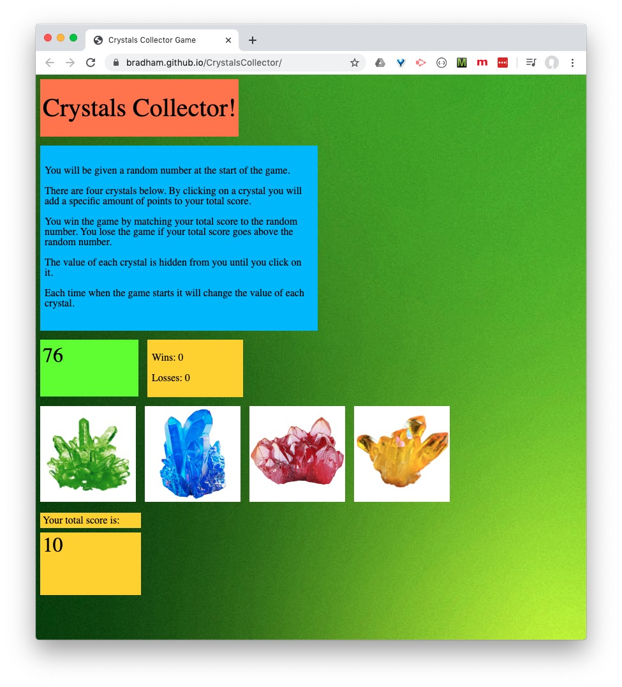

# CrystalsCollector
Try to match the number by clicking the crystals. The total and value of the crystals is randomly generated. Wins and losses are kept for each session.

Find it here: https://bradham.github.io/CrystalsCollector/

